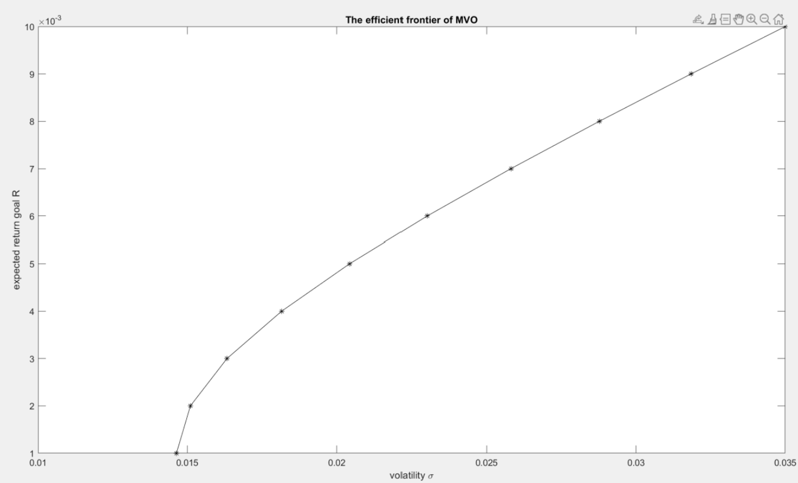

💸 Portfolio Optimization

Python | MATLAB | Quantitative Analysis | Financial Engineering | Linear Programming

📌 Project Summary

This project implements a Modern Portfolio Theory (MPT) framework to construct an optimal investment portfolio that maximizes return for a given level of risk.

Using Python and MATLAB, the model computes:
Expected returns
Covariance matrix
Portfolio variance
Efficient frontier
Optimal asset allocation

🎯 Problem Statement

Investors need to allocate capital across multiple assets in a way that:
- Maximizes expected return
- Minimizes portfolio risk
- Achieves optimal risk-adjusted performance

🛠 Technical Implementation

The model is built in Python using:
- numpy – numerical computation
- scipy.optimize – constrained optimization
- MATLAB – alternative tool for calculation and visualization

Key components include:
- Calculation of expected asset returns
- Construction of covariance matrix
- Efficient frontier simulation
- Sharpe ratio maximization
- Optimal portfolio weight allocation

📈 Key Outputs
- Efficient Frontier visualization
- Maximum Sharpe Ratio portfolio
- Minimum Variance portfolio
- Optimal asset weights

The results demonstrate how risk-return trade-offs can be quantified and optimized using computational finance techniques.

🧠 Concepts Applied
- Modern Portfolio Theory (Harry Markowitz)
- Risk-return tradeoff
- Sharpe Ratio
- Constrained nonlinear optimization
- Matrix algebra for financial modeling

Efficient Frontier

